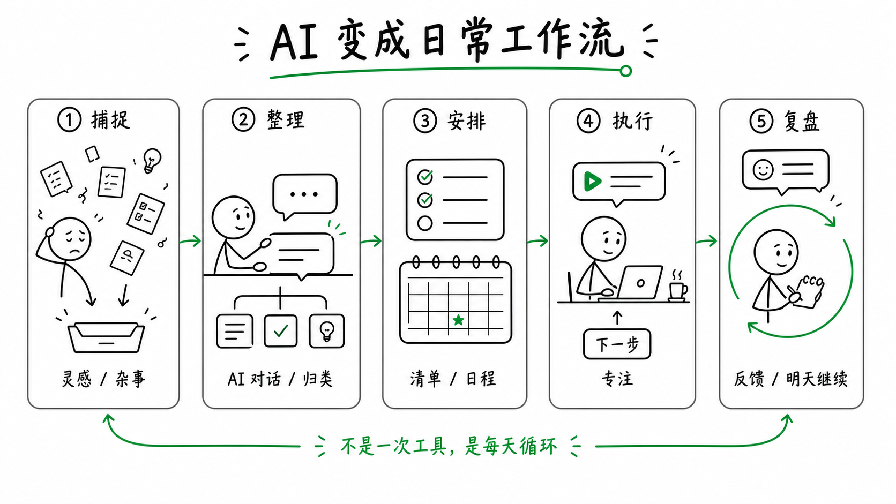
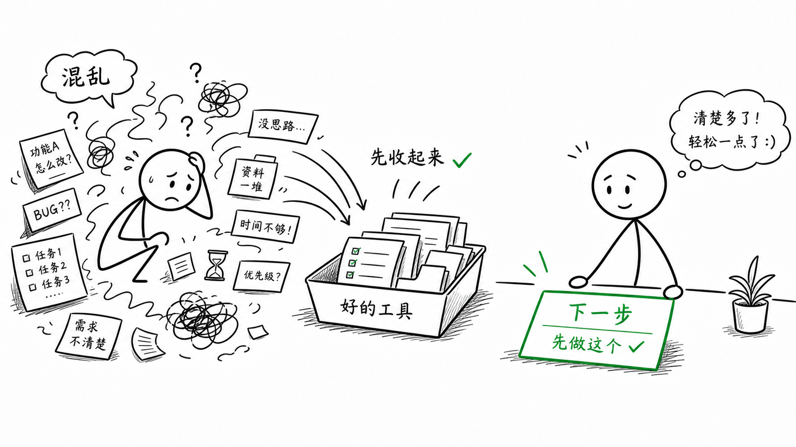
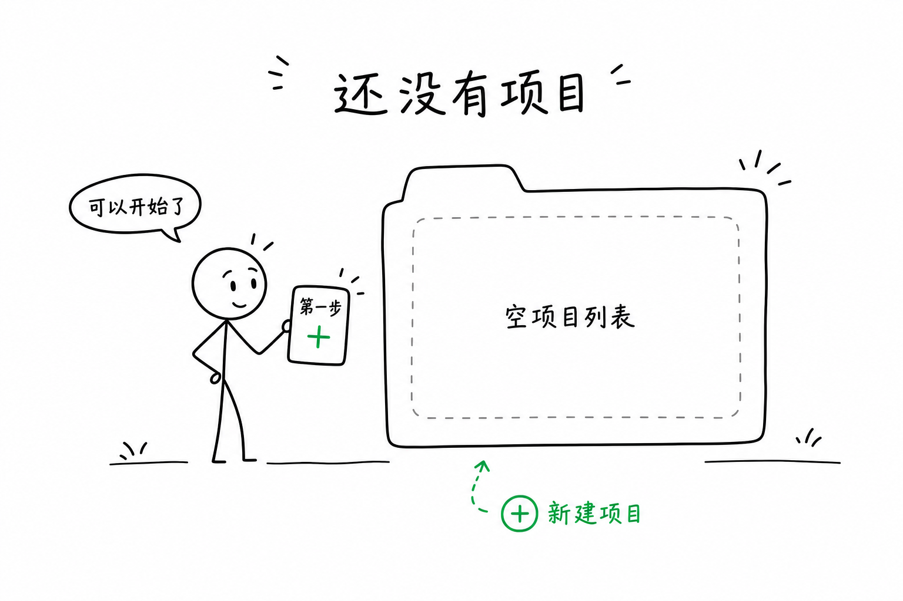
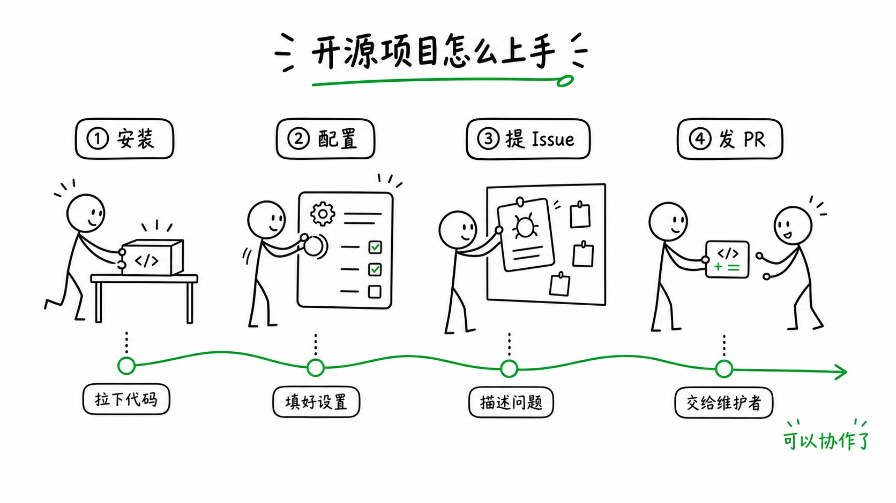

# Stick Figure Illustrations Skill

中文 | [English](./README.en.md)

这是一个适合放在 Codex 里的创作辅助 skill：把文章、文档、教程、PPT、社媒内容、开源项目说明和产品状态，转成以**有情绪的中性火柴人**为默认主体的草图式解释插画。

```text
Display name: Stick Figure Illustrations
Skill ID: stick-figure-illustrations
Usage: Use $stick-figure-illustrations ...
```

这个 skill 的重点不是生成一个固定角色、吉祥物或个人作者 IP，而是把抽象内容变成更容易理解和传播的**动作场景**：一个火柴人在选择、整理、递交、修复、搭建、观察或穿过障碍，并通过极简表情和姿态传达情绪。

默认视觉语言：

- 圆头、线条身体、简单四肢、带可读情绪的匿名火柴人
- 用户未指定时默认 `16:9` 画幅
- 白底或透明背景
- 黑色线稿
- 一个克制点缀色；用户不需要手动填写
- 大量留白
- 每张图只表达一个核心意思
- 默认加入能帮助理解的短标注：短标题、物件标签、状态词、动作词或 punchline
- 不模仿任何具体创作者、品牌、IP、插画师或公开示例风格

调用时不需要重复写这些基础要求。用户只要提供观点、文章、场景或想表达的意思，skill 会自动套用默认画幅、线稿、背景、点缀色、火柴人情绪和表达性标注规则。文字不是越少越好；除非用户明确要求无文字，否则画面会主动给关键物件、状态和下一步加短标注，让读者不用猜。

## 适合做什么

这个 skill 适合把“文字里真正需要被看见的地方”转成草图概念，而不是平均给每个段落配图。文章场景里，它的目标是让观感和阅读节奏更好；如果插图只会变成堆砌，就应该少配或不配。

常见场景：

| 场景 | 适合输出 | 默认画幅 |
|---|---|---|
| 文章 / 博客 | 正文解释图、核心观点图、前后对比图 | `16:9` / `3:2` |
| Newsletter | 邮件头图、观点总结图、轻量节奏图 | `2:1` / `16:9` |
| 社媒轮播 | 5-8 页连续概念图，每页一个动作 | `4:5` / `1:1` |
| PPT / Keynote | 章节过渡、观点旁图、结尾行动图 | `16:9` |
| 产品文档 | 安装、导入、权限、错误恢复、成功状态 | `16:9` / `3:2` / 方图 |
| 教程 / 课程 | 步骤图、练习图、反馈循环图 | `16:9` / `4:3` |
| 开源项目 | README、贡献流程、issue/PR/release 流程 | `16:9` / `2:1` |
| SaaS 界面 | 空状态、错误页、加载页、权限页、成功页 | `1:1` / `3:2` / 透明 spot |
| 视频 / 播客 / 活动 | 缩略图概念草案、主题视觉隐喻 | `16:9` / `1:1` |

## 不适合做什么

不要用它来生成：

- 固定吉祥物、角色 IP、表情包角色或可爱贴纸
- 复杂商业插画、3D、拟物、真实截图、品牌 KV
- 正式流程图模板、复杂架构图、密集 PPT 信息图
- 模仿某个插画师、创作者、品牌或现成示例的图
- 需要大量文字排版的海报或封面终稿

如果你需要的是“设计师级成品海报”，这个 skill 更适合作为前期概念草图和 shot list 工具。

## 安装

### 推荐方式：直接让 Codex 安装

在 Codex 里新开一个对话，把这个 GitHub 链接发给 Codex，然后让它帮你安装：

```text
请帮我安装这个 Codex skill：
https://github.com/ZekerTop/stick-figure-illustrations
```

Codex 会读取这个仓库里的 skill 文件，并把它安装到本地 skills 目录。安装完成后，按 Codex 的提示刷新或重启 Codex。

如果你 fork 了仓库，把链接换成自己的 GitHub 仓库地址即可。

### 本地源码安装

把 skill 文件夹复制到 Codex skills 目录：

```bash
mkdir -p "${CODEX_HOME:-$HOME/.codex}/skills"
cp -R ./stick-figure-illustrations "${CODEX_HOME:-$HOME/.codex}/skills/"
```

然后重启 Codex。

## 最快开始

先让 skill 读文章并规划，不要急着生图：

```text
Use $stick-figure-illustrations 阅读下面文章，先不要生图。

<粘贴文章>
```

用户只需要贴内容；插图数量、插入位置、画幅、字段、优先级和下一步提示都由 skill 默认处理。

为什么推荐先做 shot list：

- 长文不应该平均配图，应该挑最能改善观感、节奏或理解的认知转折
- 一张图只表达一个意思，能避免复杂信息图和 PPT 模板感
- 先筛出 `P0` 图，再生成，能节省图片生成次数
- 可以先和人确认构图，再进入生图或改图

## 工作流

### 1. 读内容，找视觉锚点

skill 会先从内容中挑出适合视觉化的部分，例如：

- 核心判断
- 复杂概念的简单隐喻
- 前后对比
- 用户卡点
- 能改善阅读观感和节奏的停顿点
- 步骤转换
- 输入输出
- 决策分岔
- 成果展示

不适合被画出来的段落会被跳过。

### 2. 输出 shot list

默认先给出 3-6 张候选图。短内容可以只有 0-2 张；课程、长文或轮播可以扩到 8-10 张，但每张都要说明用途。

如果文章本身已经很顺，或者没有真正适合视觉化的位置，可以直接建议少配甚至不配，不需要凑数量。

推荐结构：

| # | 优先级 | 放置位置 | 画幅 | 主题 | 核心意思 | 构图模式 | 火柴人动作 | 情绪 | 主要元素 | 标注 | 是否生成 |
|---|---|---|---|---|---|---|---|---|---|---|---|
| 1 | P0 | 开头位置 | 16:9 | 从混乱到路径 | 把分散任务整理成可执行路线 | Container | 火柴人把散落卡片收进整理盘，再抽出下一步 | 困惑后变专注 | 卡片 / 整理盘 / 下一步卡片 | 短标题：混乱进盒；标签：输入碎片 / 整理中 / 下一步 | 是 |

优先级含义：

- `P0`: 必画，能明显帮助理解或传播
- `P1`: 有用，能改善节奏或辅助说明
- `P2`: 可选，容易变成装饰或重复

每次输出 shot list 后，都应该给出“下一步”提示，让用户知道可以直接回复什么：

```text
下一步：
- 回复“生成 #1”
- 回复“生成 #1 和 #2”
- 回复“调整 #1：不要文字，用蓝色点缀色”
- 回复“先不生成，重新检查插图位置”
```

### 3. 选中一张再生成

生成单张图时，skill 会自动在生图提示词里处理：

- 中性火柴人作为主体
- 火柴人的情绪能被一眼读懂
- 白底或透明背景
- 黑色线稿
- 一个点缀色
- 留白
- 短标题或 punchline，以及关键物件、状态、动作的短标注
- 禁止第三方 IP、固定角色和特定作者风格

每张图单独生成，不默认把多张图拼成一张。

### 4. 检查和迭代

生成后用 QA 清单检查：

- 火柴人是不是承担核心动作
- 火柴人有没有可读情绪，而不是无表情站立
- 有没有变成吉祥物、表情包、动物或复杂角色
- 是否只有一个核心意思
- 缩小后是否还能读懂
- 是否像 PPT 模板或正式流程图
- 点缀色是否只有一个
- 标注是否能帮助理解；不能空到看不懂，也不能多到像说明书
- 有没有模仿具体风格、品牌或公开示例

如果文字容易出错，优先生成无文字版，然后在设计工具里加字。

## Presets

用 preset 可以让输出更稳定：

| Preset | 用途 | 默认数量 | 画幅 | 重点 |
|---|---|---:|---|---|
| `article` | 博客、文章、长文笔记 | 3-6 | 默认 `16:9` | 关键认知转折 |
| `newsletter` | 邮件、周报、精选摘要 | 1-3 | 默认 `16:9` | 轻量节奏 |
| `carousel` | 社媒轮播 | 5-8 | `4:5` / `1:1` | 一页一个动作 |
| `slides` | PPT、Keynote、演讲 | 3-8 | `16:9` | 辅助观点，不抢层级 |
| `product-doc` | 产品文档、帮助中心 | 2-5 | 默认 `16:9` | 用户任务和系统状态 |
| `saas-state` | 空状态、错误、权限、加载、成功 | 1 | `1:1` / `3:2` / transparent spot | 轻量标注、适合 UI |
| `course` | 教程、课程、讲义 | 4-10 | `16:9` / `4:3` | 学习动作 |
| `readme` | 开源 README、贡献指南、release notes | 2-4 | 默认 `16:9` | 工程文档气质 |
| `thumbnail` | 视频、播客、活动、文章头图草案 | 1-3 | 默认 `16:9` | 强隐喻，不做终稿海报 |

示例：

```text
Use $stick-figure-illustrations 用 carousel preset 把这个主题设计成社媒轮播，先不要生图。

主题：一个人如何把 AI 变成日常工作流
```



## 可复制例子

### 为文章规划配图

```text
Use $stick-figure-illustrations 阅读下面文章，先不要生图。

<粘贴文章>
```

### 为文章优化观感并直接生成插图

```text
Use $stick-figure-illustrations 为下面文章找适合插图的位置，并直接生成能改善阅读观感的图片。

<粘贴文章>
```

### 生成观点图

```text
Use $stick-figure-illustrations 为这个观点生成一张图：

“好的工具会把混乱收起来，把下一步摆到你面前。”
```



默认就按有表现力的观点图处理：使用 `16:9`、白底黑线、一个克制点缀色和有情绪的中性火柴人。用户不需要额外写“有表现力”。图片可以包含短标题、状态词、对比词或一句 punchline；重点不是少字，而是让文字增强表达力。

### 做 SaaS 空状态

```text
Use $stick-figure-illustrations 用 saas-state preset 生成空状态插图：

状态：用户还没有创建任何项目。
```



### 给开源项目 README 规划插图

```text
Use $stick-figure-illustrations 用 readme preset 为这个开源项目 README 规划插图。

场景：
1. 安装
2. 配置
3. 提交 issue
4. 发起 PR
```



更多中文示例见 [examples/prompts.md](examples/prompts.md)，英文示例见 [examples/prompts.en.md](examples/prompts.en.md)。

## 构图模式

`Scene Patterns` 指的是“观点要怎么被画出来”的构图模式，不是使用场景。每张图只选一种主模式，避免变成复杂信息图：

| 构图模式 | 适合表达 | 典型画法 |
|---|---|---|
| `Before/After` | 混乱到清晰、手动到自动、猜测到验证 | 左旧右新，中间有转换动作 |
| `Path` | 用户旅程、学习路线、发布流程 | 人物沿 3-5 个节点前进 |
| `Hand-off` | 团队协作、agent 接力、内容链路 | 人物传递一个对象 |
| `Stack` | 方法层级、能力栈、高层架构 | 人物搭建或检查几层盒子 |
| `Split-Merge` | 分流、聚合、多渠道输出 | 一个输入分成多个输出，或反过来 |
| `Trade-off` | 速度 vs 质量、自动化 vs 控制 | 人物在天平、滑杆或两扇门之间选择 |
| `Obstacle` | 卡点、权限、bug、信息过载 | 人物拆开、绕过或标记障碍 |
| `Loop` | 反馈循环、迭代、训练、复盘 | 人物推动一个简单循环 |
| `Container` | 收纳混乱、整理信息、沉淀知识库 | 火柴人把碎片放进盒子、托盘或文件夹 |
| `Workbench` | AI 工作流、创作加工、调试 | 左边原料，中间处理，右边产出 |
| `Checklist` | 安装、配置、onboarding、发布检查 | 火柴人勾掉当前步骤并摆出下一步 |
| `Map` | 定位问题、规划路线、从未知到可执行 | 地图上标出当前位置、目标和路线 |
| `Signal-Noise` | 信息过载、筛选重点、判断依据 | 噪声经过筛网变成清晰信号 |
| `Zoom-in` | 放大关键细节、拆解隐藏原因 | 用放大框突出真正要处理的一步 |

默认会给关键物件和状态加短标注，例如“输入碎片”“整理中”“下一步”“卡住点”“已完成”。如果图里只有物件没有标注，通常需要重画或补字。

## 仓库结构

```text
stick-figure-illustrations/
├── README.md
├── README.en.md
├── examples/
│   ├── prompts.md
│   └── prompts.en.md
├── stick-figure-illustrations/
│   ├── SKILL.md
│   ├── agents/
│   │   └── openai.yaml
│   └── references/
│       ├── presets.md
│       ├── prompt-template.md
│       ├── qa-checklist.md
│       ├── scene-patterns.md
│       ├── shot-list-schema.md
│       ├── use-cases.md
│       └── visual-system.md
└── .gitignore
```

## 参考文件说明

| 文件 | 作用 |
|---|---|
| `stick-figure-illustrations/SKILL.md` | skill 主入口，定义触发条件、硬性边界和工作流 |
| `references/visual-system.md` | 火柴人视觉规范、色彩、文字和禁忌 |
| `references/use-cases.md` | 不同场景的推荐输出形式 |
| `references/presets.md` | preset 的画幅、数量、密度和目标 |
| `references/shot-list-schema.md` | shot list 字段和优先级规则 |
| `references/scene-patterns.md` | 构图模式和隐喻生成方法 |
| `references/prompt-template.md` | 单张生图、无文字版、改图模板 |
| `references/qa-checklist.md` | 生成后检查和迭代规则 |
| `examples/prompts.md` | 可复制调用示例 |

## 维护建议

更新这个 skill 时，优先保持三件事一致：

1. `SKILL.md` 里的工作流和 README 的说明一致。
2. `references/presets.md` 里的 preset 名称和 README 的表格一致。
3. `examples/prompts.md` 里的例子能覆盖最常见场景，不要只展示一种文章配图。

新增 preset 时，至少同步更新：

- `stick-figure-illustrations/references/presets.md`
- `stick-figure-illustrations/references/use-cases.md`
- `examples/prompts.md`
- `README.md`

## License

No license has been selected yet. Choose a license before publishing this as an open-source project.
